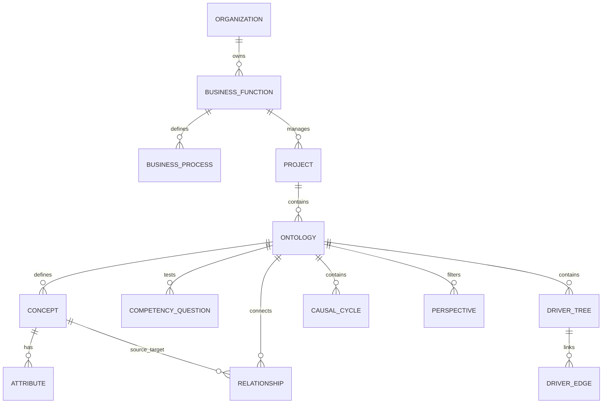

# AI Ontology Modeler - System Documentation

## Executive Summary

**AI Ontology Modeler** is an enterprise-grade, web-based semantic ontology modeling and visualization platform built with Next.js 16, React 19, TypeScript, Prisma ORM, PostgreSQL, and Three.js / React Three Fiber.

It enables enterprise architects, domain experts, and data scientists to interactively create, refine, audit, and visualize business ontologies in 3D. The system integrates a multi-agent LLM pipeline that converts business requirements and competency questions into structured, connected domain graphs complete with processes, metrics, entities, driver trees, and causal feedback cycles.

---

## Architecture Overview

```mermaid
graph TD
    Client[Browser / Client UI] -->|React 19 / Three.js 3D View| NextApp[Next.js 16 App Router]
    
    subgraph Frontend Components
        ModelerPanel[Modeler Panel & Wizard]
        ThreeCanvas[3D Force-Directed Graph Canvas]
        ChatPanel[AI Probing & Chat Assistant]
        QualityCard[Ontology Quality Score Card]
        Lineage[Lineage Breadcrumbs Nav]
    end

    NextApp --> ModelerPanel
    NextApp --> ThreeCanvas
    NextApp --> ChatPanel
    
    subgraph API Layer
        OntologyAPI[/api/ontologies]
        AIGenerateAPI[/api/ontologies/:id/ai-generate]
        ConceptsAPI[/api/concepts]
        RelationshipsAPI[/api/relationships]
        DriverAPI[/api/driver-edges]
    end

    NextApp --> API Layer

    subgraph AI Engine & Pipeline
        ClassifierPass[1. Classifier & Probing Pass]
        GeneratorPass[2. Generator Pass]
        AuditorPass[3. Auditor & Corrector Pass]
        GraphWeaver[4. Graph Weaver Engine]
    end

    AIGenerateAPI --> ClassifierPass
    ClassifierPass --> GeneratorPass
    GeneratorPass --> AuditorPass
    AuditorPass --> GraphWeaver

    subgraph LLM Providers
        LMStudio[Local LM Studio / Ollama]
        OpenAI[OpenAI GPT-4o API]
        Anthropic[Anthropic Claude API]
        Google[Google Gemini API]
    end

    ClassifierPass & GeneratorPass & AuditorPass --> LLM Providers

    subgraph Storage Layer
        Prisma[Prisma ORM Adapter]
        Postgres[(PostgreSQL Database)]
    end

    GraphWeaver & API Layer --> Prisma --> Postgres
```

---

## 1. System Components & File Structure

```
ai-ontology-modeler/
├── prisma/
│   ├── schema.prisma         # Full database relational schema
│   └── seed.ts               # Default domain templates, CQs, and seed ontologies
├── src/
│   ├── app/                  # Next.js App Router pages and API endpoints
│   │   ├── api/              # 18 REST API route controllers
│   │   ├── page.tsx          # Main Workbench dashboard UI
│   │   ├── globals.css       # Design tokens, glassmorphism, & dark mode styling
│   │   └── layout.tsx        # App layout wrapper & metadata
│   ├── components/           # UI & 3D Visualization Components
│   │   ├── ModelerPanel.tsx  # Central 3D canvas control & ontology editor
│   │   ├── ThreeCanvas.tsx   # Interactive 3D WebGL graph rendering engine
│   │   ├── ChatPanel.tsx     # AI copilot & interactive probing assistant
│   │   ├── QualityScoreCard.tsx # Real-time ontology quality metrics
│   │   ├── AgentStepper.tsx  # Guided 4-phase modeling wizard step tracker
│   │   └── LineageBreadcrumb.tsx # Enterprise org -> process -> ontology hierarchy navigation
│   └── lib/                  # Core Business & AI Logic Engines
│       ├── agentPipeline.ts  # Multi-pass AI agent orchestration engine
│       ├── graphWeaver.ts    # Deterministic graph connectivity & weaving engine
│       ├── qualityEvaluator.ts# Quality metric computation engine
│       ├── ontologyMerger.ts # Ontology import and conflict-resolution merger
│       ├── causalCycleDetector.ts # Graph cycle & causal feedback loop detection
│       └── db.ts             # Prisma PostgreSQL connection pooling setup
├── scripts/                  # Utility scripts (RDF parser, CLI tools)
├── .env.example              # Environment variables template
├── SETUP_GUIDE.md            # Windows & macOS installation guide
└── DOCUMENTATION.md          # Comprehensive system documentation
```

---

## 2. Core Features & Capabilities

### 1. Interactive 3D Graph Visualization (`ThreeCanvas.tsx`)
- Render concepts as 3D spatial nodes with distinct color coding according to node type:
  - **Entity**: Gold / Yellow spheres
  - **Process**: Blue spheres
  - **Metric**: Cyan / Teal spheres
  - **Persona**: Magenta / Purple spheres
- Spatial physics & auto-layout force simulation using `@react-three/fiber` and `@react-three/drei`.
- Real-time 3D node selection, camera focus, dragging, and directional relationship edge rendering.

### 2. Guided 4-Phase Modeling Wizard (`AgentStepper.tsx` & `ModelerPanel.tsx`)
- **Phase 1: Processes & Entities** - Define core domain workflows, actors, objects, and attributes.
- **Phase 2: Process Metrics** - Define operational, financial, and clinical KPIs and indicators.
- **Phase 3: Competency Questions (CQs)** - Define questions that the ontology graph must be able to answer.
- **Phase 4: Causal Driver Trees & Causal Cycles** - Structure causal dependency chains and feedback loops (reinforcing `R` vs balancing `B`).

### 3. Multi-Pass AI Generation Engine (`/api/ontologies/[id]/ai-generate/route.ts`)
- **Interactive Probing Pass**: If user prompts are ambiguous, the LLM generates structured clarification questions before executing graph modifications.
- **Incremental Generation**: Safely merges new concepts/relationships with existing ontology state without destroying legacy nodes.
- **Auditor & Corrector Pass**: Validates concept uniqueness, relationship cardinality, and business logic before persisting.
- **100% Graph Weaver Engine**: Guarantees zero orphan concepts by auto-stitching isolated nodes into structured relational pathways: `Personas -> Processes -> Events -> Entities -> Systems -> Metrics`.

### 4. Enterprise Lineage & Organizational Hierarchy (`LineageBreadcrumb.tsx`)
- Maps ontologies to enterprise hierarchy:
  - `Organization` ➔ `BusinessFunction` ➔ `BusinessProcess` ➔ `Project` ➔ `Ontology` ➔ `ContextPack`.

### 5. Multi-Provider LLM Integration (`LlmConfiguration` table)
- Supports switching runtime LLM backends:
  - **LM Studio** / **Ollama** (Local offline inference)
  - **OpenAI** (`gpt-4o`, `gpt-4-turbo`)
  - **Anthropic** (`claude-3-5-sonnet`)
  - **Google Gemini** (`gemini-1.5-pro`, `gemini-2.0-flash`)

---

## 3. Data Model & Database Schema

The system uses PostgreSQL managed via Prisma. The schema includes 22 interrelated models:



### Key Models Description:

| Model Name | Description |
| :--- | :--- |
| **`Ontology`** | Root container for domain models, namespace URIs, versions, and industry metadata. |
| **`Concept`** | Nodes in the graph representing Entities, Processes, Metrics, or Personas. |
| **`Attribute`** | Datatype fields attached to concepts (string, integer, float, boolean). |
| **`Relationship`** | Edge connections between source and target concepts with cardinality (`one-to-many`, `one-to-one`, etc.). |
| **`CompetencyQuestion`** | Business queries and verification status testing ontology coverage. |
| **`DriverTree` & `DriverEdge`** | Causal performance metric hierarchies with weighted influence polarities (`+` / `-`). |
| **`CausalCycle`** | Feedback loop definitions referencing driver edges (Reinforcing vs. Balancing). |
| **`Perspective`** | Persona-based sub-views filtering concept visibility for specific enterprise roles. |
| **`System` & `DataSource`** | Physical IT systems (ERP, CRM, LIMS) mapped to concepts via `DataMapping`. |

---

## 4. API Reference

The server exposes REST endpoints under `/api`:

### Core Endpoints:

- `POST /api/ontologies` - Create a new ontology.
- `GET /api/ontologies/[id]` - Retrieve full ontology graph (concepts, attributes, relationships, CQs, trees).
- `POST /api/ontologies/[id]/ai-generate` - Trigger AI generation pipeline for an ontology.
- `GET /api/concepts?ontologyId=...` - Fetch concepts for a given ontology.
- `POST /api/concepts` - Add a new concept node manually.
- `POST /api/relationships` - Connect two concepts with a relationship edge.
- `GET /api/cqs` - Manage competency questions.
- `GET /api/driver-edges` - Manage causal driver tree connections.
- `GET /api/llm-configs` - List and update active LLM model configurations.
- `GET /api/models` - Query available models from the local LM Studio / Ollama endpoint.

---

## 5. Quality Score Evaluation Engine

The `qualityEvaluator.ts` module computes a real-time health and quality score (0 - 100%) for any given ontology:

$$\text{Quality Score} = (w_1 \times \text{CQ Coverage}) + (w_2 \times \text{Relationship Density}) + (w_3 \times \text{Attribute Completeness}) + (w_4 \times \text{Causal Tree Completeness})$$

- **CQ Coverage**: Percentage of competency questions that have matching mapped concepts.
- **Relationship Density**: Ratio of connected relationships to total concepts (ensures node connectivity).
- **Attribute Completeness**: Proportion of concepts containing defined data attributes.
- **Causal Tree Completeness**: Presence of structured metric driver trees and feedback cycles.

---
